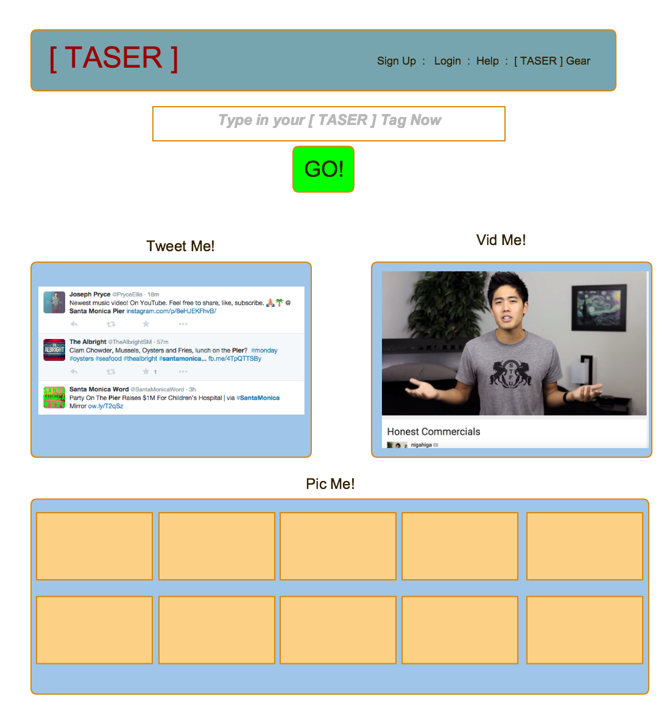

#Three Amigos Search Exploration Resource...popularly known as [ TASER ] 

##Project - Build [ TASER ]

[ TASER ] is a website that allows a user to input a search term once and see how the rest of the world interacts with and perceives that term.  Specifically, once a search term is input we will populate a page with images, tweets, and audio/visuals that will create a 360 degree experience for our user.  

###Strategy  

Connect to the following APIs in order to create this rich search experience for our user:  

- Flickr - to access and use pictures
- YouTube - to access and use audio/video files
- Twitter - to access text-based tweets   

###User Stories

1. A user will find the [ TASER ] website
2. A user will create a new account, setting up email and password
3. A user will login with username and password
4. A user will start a new [ TASER ] search
5. A user will search on a word or term
6. A user will wait for his TASER page to populate
7. A user will view the populated TASER site from all three API sources
9. A user can clear their TASER search page and start a new TASER search
10. A user can have their life changed by this incredible new way to approach the search experience

###Models   
 There are two models:  
 
1. User model 
2. Comment model 

###Wireframes  

##Thursday 

1. Styling
2. taser imgage after pressing search
3. clear search results
4. add detail to taser gear page
5. test chat app from two computers
6. clean up and finish readme
7. rehearse presentation for Friday

     

