#Three Amigos Search Exploration Resource...popularly known as [ TASER ] 

##Project - Build [ TASER ]

##Deployed Site: [https://taserisreal.herokuapp.com/](link)

[ TASER ] is a website that allows a user to input a search term once and see how the rest of the world interacts with and perceives that term.  Specifically, once a search term is input we will populate a page with images, tweets, and audio/visuals that will create a 360 degree experience for our user.  

###Strategy  

Connect to the following APIs in order to create this rich search experience for our user:  

- Flickr - to access and use pictures
- YouTube - to access and use audio/video files
- Twitter - to access text-based tweets   

###User Stories

1. A user will find the [ TASER ] website
2. A user will create a new account, setting up email and password
3. A user will login with username and password
4. A user will start a new [ TASER ] search
5. A user will search on a word or term
6. A user will wait for his TASER page to populate
7. A user will view the populated TASER site from all three API sources
9. A user can clear their TASER search page and start a new TASER search
10. A user can have their life changed by this incredible new way to approach the search experience

###Wireframes  

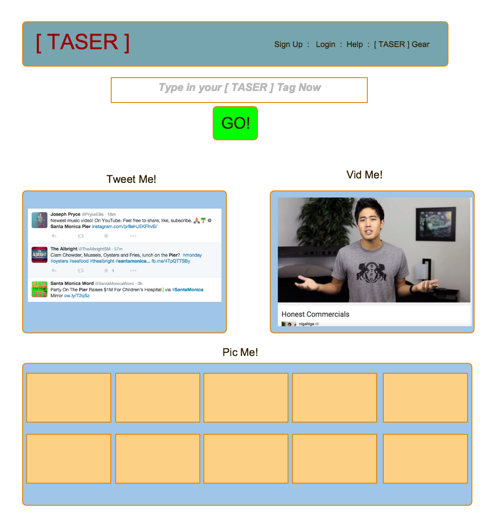

##Search

[TASER] begins with the search bar. A user inputs the term they want immerse themselves in and *Tases* it.s

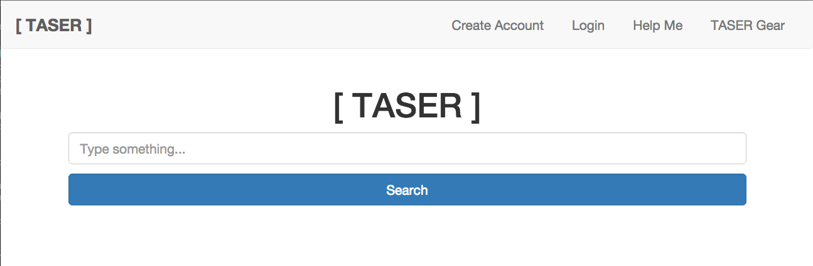

The bar takes text as its input based on the type. After the user clicks the search button, the **submit** type and **search** value initializes the **response** id and begin a chain reaction initializing the 3 APIs. 

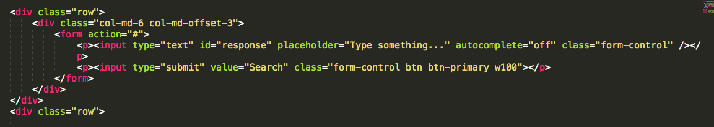	

##Twitter API

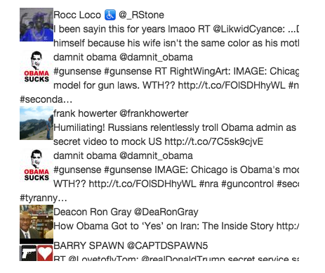

####Initialize
After setting up the libraries/frameworks our site depends on. Twitter's API begins by authenticating through a set of private user keys which allow our app to obtain data.	

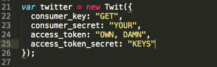

####Search
The **submit** from above starts up the twitter form which starts by preventing the default action of the event from prematurely submitting information from various events. The response is then assigned a value which we use to search by changing the data to something useable in searchTerm. 

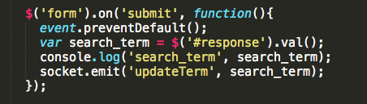

####Results
Once socket is turned on and connected, the stream is started. Stream is tracked based on the search term. It is here that data is constanly being gathered with a timeout function cutting off the stream in order to limit tweets and make our display more readable. 

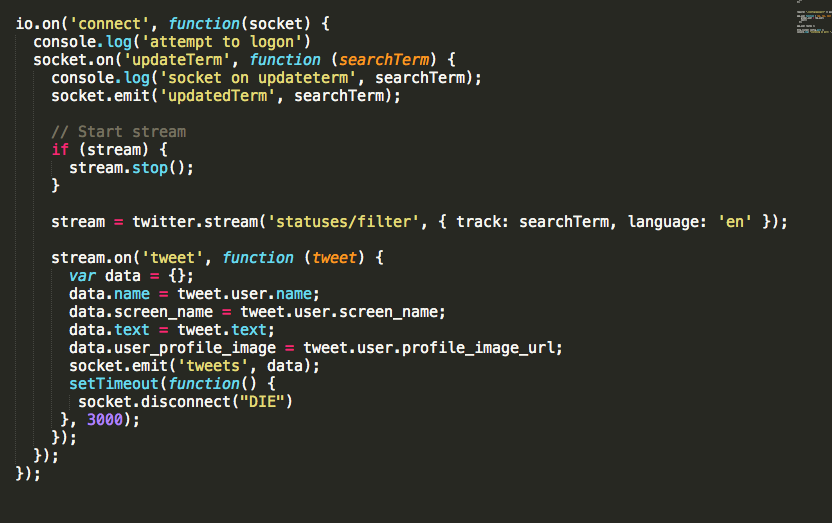

Tweets are finally prepended in our tweet-container according to the information received

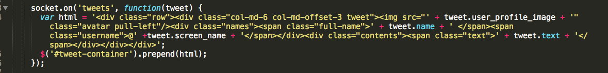

##Youtube API

####Initializing
Functioning much in the same way as the Twitter API, the Youtube code authenticates with a personal key and loads the selected version of the service.
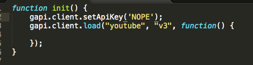

####Search
Using JQUERY, the API receives its orders from the search form's **submit** input while simultaneously preventing the premature sending of information.
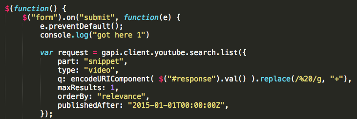

####Results
Thhe query is then defined by the **response** ID and given a value to be searched by. 
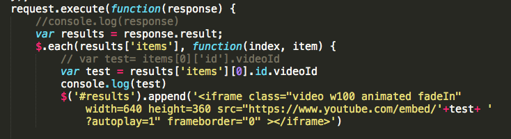

Finally the request is executed with results determined by the results variable. The selected video is then displayed through an i-frame tag.

##Flickr API

####Search
Unlike the API above, flickr doesn't need keys to access data. Using JQUERY, the API receives its orders from the search form's **submit** input. 

It then obtains a photo stream via JSON. Results are checked by tags, which are based on the response ID. 

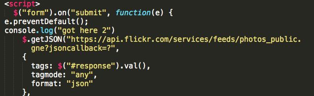

####Results
Finally images populate the page, with the number of images based on a set number.

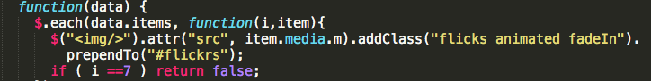 

     

